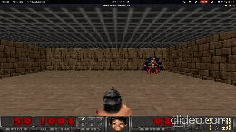
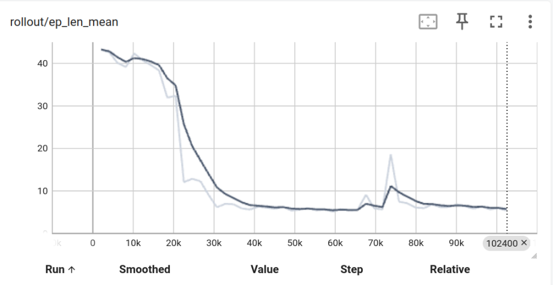
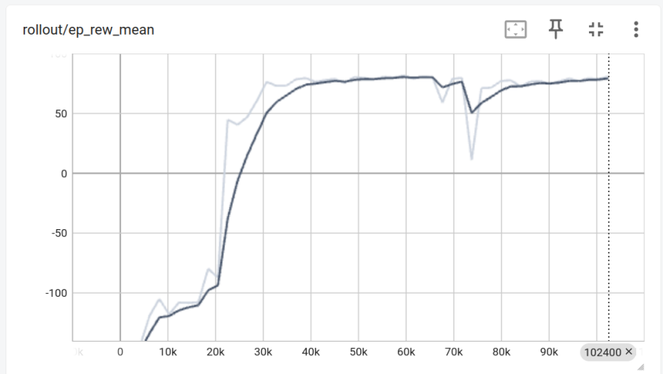

# 🎮 VizDoom Reinforcement Learning with PPO

## Project Overview

This project explores the application of **Deep Reinforcement Learning (DRL)** to a visually rich, partially observable environment using the **VizDoom** platform. We train an AI agent using the **Proximal Policy Optimization (PPO)** algorithm — a popular on-policy method known for its robustness and performance — to navigate and survive in a Doom-like environment.

The objective is to enable the agent to learn intelligent behavior from raw pixel data and minimal feedback signals (rewards), without any prior knowledge of the game. This demonstrates how modern RL algorithms can handle high-dimensional inputs and complex decision-making scenarios.

### 🔍 Key Highlights

- 🎮 **Environment:** Built on the classic FPS game Doom via VizDoom.
- 🤖 **Agent:** Trained using PPO from [Stable-Baselines3](https://github.com/DLR-RM/stable-baselines3).
- 🧠 **Learning Input:** Raw RGB image frames from the game screen.
- 🎯 **Goal:** Maximize cumulative rewards by surviving and navigating the map effectively.
- 📈 **Monitoring:** Training progress tracked with TensorBoard.
- 🧪 **Modular Design:** Easy to tweak environment settings, rewards, and hyperparameters.

This project is ideal for anyone interested in combining computer vision, reinforcement learning, and classic gaming environments. It serves as a practical stepping stone toward mastering RL in 3D environments and first-person games.

<p align="center">
  
</p>   

---

## 🕹️ Environment Overview

**VizDoom** is an AI research platform based on the classic FPS game *Doom*. It provides a flexible and visual-rich environment for developing RL agents. Key features include:

- First-person 3D perspective
- Partial observability
- Configurable resolution and frame rendering
- Customizable action and reward spaces
- Multiple scenarios (combat, navigation, survival)

---
## Graphical Results

<p align="center">
  
</p>

<p align="center">
  
</p>

---


## ⚙️ Installation  
To run this project, ensure you have the following dependencies installed:

- Python 3.7 or higher
- [VizDoom](https://github.com/mwydmuch/ViZDoom)
- [Stable-Baselines3](https://github.com/DLR-RM/stable-baselines3)
- [PyTorch](https://pytorch.org/)
- [OpenAI Gym](https://www.gymlibrary.dev/)
- NumPy
- Matplotlib
- TensorBoard  

Install all necessary packages with:

```bash
pip install vizdoom stable-baselines3[extra] torch gym[box2d] numpy matplotlib
```
---
## 🔗 `References`  :


- [VizDoom Official Website](https://vizdoom.cs.put.edu.pl/)
- [VizDoom GitHub Repository](https://github.com/mwydmuch/ViZDoom)
- [Stable-Baselines3 Documentation](https://stable-baselines3.readthedocs.io/)
- [Proximal Policy Optimization (PPO) — OpenAI Spinning Up](https://spinningup.openai.com/en/latest/algorithms/ppo.html)
- [OpenAI Gym Documentation](https://www.gymlibrary.dev/)
- [PyTorch Documentation](https://pytorch.org/docs/)
